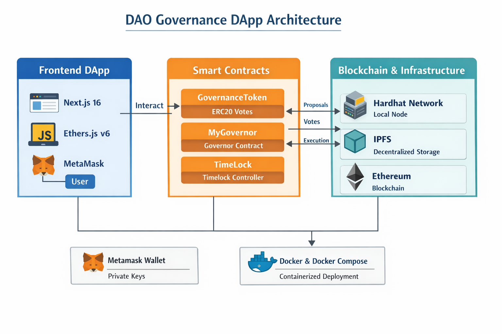

# DAO Governance DApp

A full-stack decentralized governance system built using Solidity, Hardhat, and Next.js.

---
##  Architecture Diagram



---

#  Quick Start (Docker - One Command)

```bash
docker-compose up --build
```

Hardhat RPC → http://localhost:8545  
Frontend → http://localhost:3000  

---

#  Running Locally (Manual Setup)

## 1️ Install Dependencies

```bash
npm install
cd frontend
npm install
```

---

## 2️ Start Hardhat Node

```bash
npx hardhat node
```

---

## 3️ Deploy Contracts

Open new terminal:

```bash
npx hardhat run scripts/deploy.js --network localhost
```

Copy the Governor contract address and update it in:

```
frontend/app/page.tsx
```

---

## 4️ Start Frontend

```bash
cd frontend
npm run dev
```

Open:

```
http://localhost:3000
```

---

#  Run Tests

```bash
npx hardhat test
```

Expected:

```
DAO Governance Full Flow
✔ Should complete full governance lifecycle
```

---

#  Project Structure

```
dao-governance-dapp/
├── contracts/
├── scripts/
├── test/
├── frontend/
├── Dockerfile.backend
├── Dockerfile.frontend
├── docker-compose.yml
├── hardhat.config.js
├── package.json
├── .env.example
└── README.md
```

---

#  Environment Variables

Create `.env` from `.env.example`:

```
NEXT_PUBLIC_GOVERNOR_ADDRESS=
RPC_URL=http://localhost:8545
```

---

# Governance Flow

1. Delegate voting power
2. Create proposal
3. Wait voting delay
4. Vote
5. Wait voting period
6. Queue proposal
7. Wait timelock delay
8. Execute proposal

---

#  MetaMask Setup

Add Hardhat network:

RPC URL: http://127.0.0.1:8545  
Chain ID: 31337  
Currency Symbol: ETH  

---

#  Author

Lahari Sri Kotipalli  
GitHub: https://github.com/Laharisrikotipalli
